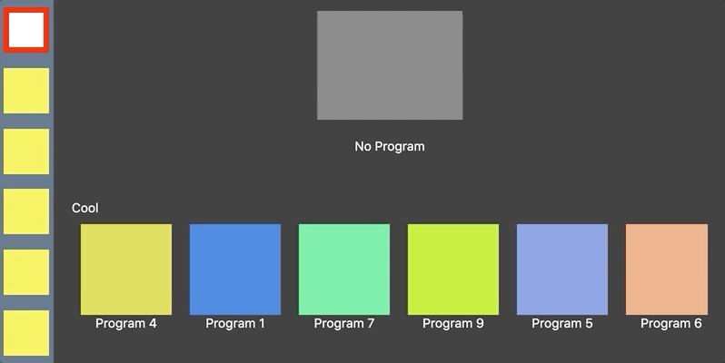

# react-spatial-navigation
[](https://badge.fury.io/js/%40noriginmedia%2Freact-spatial-navigation)

## Motivation
The main motivation to create this package was to bring the best Developer Experience and Performance when working with Key Navigation and React. Ideally you wouldn't want to have any logic to define the navigation in your app. It should be as easy as just to tell which components should be navigable. With this package all you have to do is to initialize it, wrap your components with the HOC and set initial focus. The spatial navigation system will automatically figure out which components to focus next when you navigate with the directional keys.

## Article
[Smart TV Navigation with React](https://medium.com/norigintech/smart-tv-navigation-with-react-86bd5f3037b7)

# Changelog
[CHANGELOG.md](https://github.com/NoriginMedia/react-spatial-navigation/blob/master/CHANGELOG.md)

# Table of Contents
* [Example](#example)
* [Installation](#installation)
* [Usage](#usage)
* [API](#api)
* [Development](#development)
* [TODOs](#todos)

# Example


[Testbed Example](https://github.com/NoriginMedia/react-spatial-navigation/blob/master/src/App.js)

# Installation
```bash
npm i @noriginmedia/react-spatial-navigation --save
```

# Usage

## Initialization
```jsx
// Somewhere at the root of the app

import {initNavigation, setKeyMap} from '@noriginmedia/react-spatial-navigation';

initNavigation();

// Optional
setKeyMap({
  'left': 9001,
  'up': 9002,
  'right': 9003,
  'down': 9004,
  'enter': 9005
});
```

## Making component focusable
```jsx
import {withFocusable} from '@noriginmedia/react-spatial-navigation';

...

const FocusableComponent = withFocusable()(Component);
```

## Using config options
```jsx
import {withFocusable} from '@noriginmedia/react-spatial-navigation';

...

const FocusableComponent = withFocusable({
  trackChildren: true,
  forgetLastFocusedChild: true
})(Component);
```

## Using props on focusable components
```jsx
import {withFocusable} from '@noriginmedia/react-spatial-navigation';

...

const FocusableComponent = withFocusable()(Component);

const ParentComponent = (props) => (<View>
  ...
  <FocusableComponent
    trackChildren
    forgetLastFocusedChild
    focusKey={'FOCUSABLE_COMPONENT'}
    onEnterPress={props.onItemPress}
    onArrowPress={props.onArrowPress}
    onBecameFocused={props.onItemFocused}
    onBecameBlurred={props.onItemBlurred}
    autoRestoreFocus={false}
  />
  ...
</View>);
```

## Using props inside wrapped components
### Basic usage
```jsx
import {withFocusable} from '@noriginmedia/react-spatial-navigation';

const Component = ({focused, setFocus}) => (<View>
  <View style={focused ? styles.focusedStyle : styles.defaultStyle} />
  <TouchableOpacity 
    onPress={() => {
      setFocus('SOME_ANOTHER_COMPONENT');
    }}
  />
</View>);

const FocusableComponent = withFocusable()(Component);
```

### Setting initial focus on child component, tracking children
```jsx
import React, {PureComponent} from 'react';
import {withFocusable} from '@noriginmedia/react-spatial-navigation';

...

class Menu extends PureComponent {
  componentDidMount() {
    // this.props.setFocus(); // If you need to focus first child automatically
    this.props.setFocus('MENU-6'); // If you need to focus specific item that you know focus key of
  }

  render() {
    return (<View style={hasFocusedChild ? styles.menuExpanded : styles.defaultStyle}>
      <MenuItemFocusable />
      <MenuItemFocusable />
      <MenuItemFocusable />
      <MenuItemFocusable />
      <MenuItemFocusable />
      <MenuItemFocusable focusKey={'MENU-6'} />
    </View>);
  }
}

const MenuFocusable = withFocusable({
  trackChildren: true
})(Menu);
```

### Using in Native environment
Since in native environment the focus is controlled by the native engine, we can only "sync" with it by setting focus on the component itself when it gets focused.
Native navigation system automatically converts all `Touchable` component to focusable components and enhances them with the callbacks such as `onFocus` and `onBlur`.
Read more here: [React Native on TVs](https://facebook.github.io/react-native/docs/building-for-apple-tv).

```jsx
import {withFocusable} from '@noriginmedia/react-spatial-navigation';

const Component = ({focused, stealFocus}) => (<View>
  <View style={focused ? styles.focusedStyle : styles.defaultStyle} />
  <TouchableOpacity
    onFocus={stealFocus}
  />
</View>);

const FocusableComponent = withFocusable()(Component);
```

# API

## Top level
### `initNavigation`: function
Function that needs to be called to enable Spatial Navigation system and bind key event listeners.
Accepts [Initialization Config](#initialization-config) as a param.

```jsx
initNavigation({
  debug: true,
  visualDebug: true
})
```

#### Initialization Config
##### `debug`: boolean
Enable console debugging

* **false (default)**
* **true**

##### `visualDebug`: boolean
Enable visual debugging (all layouts, reference points and siblings refernce points are printed on canvases)

* **false (default)**
* **true**

##### `nativeMode`: boolean
Enable Native mode. It will block certain web-only functionality such as:
- adding window key listeners
- measuring DOM layout
- `onBecameFocused` and `onBecameBlurred` callbacks doesn't return coordinates, but still has node ref to lazy measure layout
- coordinates calculations when navigating
- down-tree propagation
- last focused child
- preferred focus key

Native mode should be only used to keep the tree of focusable components and to sync the `focused` flag to enable styling for focused components.
In Native mode you can only `stealFocus` to some component to flag it as `focused`, normal `setFocus` method is blocked because it will not propagate to native layer.

* **false (default)**
* **true**

##### `throttle`: integer
Enable to throttle the function fired by the event listener.

* **0 (default)**

##### `throttleKeypresses`: boolean
Prevent canceling of throttled events for individual key presses. Works only in combination with `throttle`. Useful when there are issues with the performance of handling rapidly firing navigational events.

* **false (default)**

### `setKeyMap`: function
Function to set custom key codes.
```jsx
setKeyMap({
  'left': 9001,
  'up': 9002,
  'right': 9003,
  'down': 9004,
  'enter': 9005
});
```

### `withFocusable`: function
Main HOC wrapper function. Accepts [config](#config) as a param.
```jsx
const FocusableComponent = withFocusable({...})(Component);
```

#### Config
##### `trackChildren`: boolean
Determine whether to track when any child component is focused. Wrapped component can rely on `hasFocusedChild` prop when this mode is enabled. Otherwise `hasFocusedChild` will be always `false`.

* **false (default)** - Disabled by default because it causes unnecessary render call when `hasFocusedChild` changes
* **true**

##### `forgetLastFocusedChild`: boolean
Determine whether this component should not remember the last focused child components. By default when focus goes away from the component and then it gets focused again, it will focus the last focused child. This functionality is enabled by default.

* **false (default)**
* **true**

##### `autoRestoreFocus`: boolean
To determine whether parent component should focus the first available child component when currently focused child is unmounted.
* **true (default)**
* **false**

##### `blockNavigationOut`: boolean
Disable the navigation out from the selected component. It can be useful when a user opens a popup (or screen) and you don't want to allow the user to focus other components outside this area.

It doesn't block focus set programmatically by `setFocus`.
* **false (default)**
* **true**

## Props that can be applied to HOC
All these props are optional.

### `trackChildren`: boolean
Same as in [config](#config).

### `forgetLastFocusedChild`: boolean
Same as in [config](#config).

### `autoRestoreFocus`: boolean
Same as in [config](#config).

### `blockNavigationOut`: boolean
Same as in [config](#config).

### `focusable`: boolean
Determine whether this component should be focusable (in other words, whether it's *currently* participating in the spatial navigation tree). This allows a focusable component to be ignored as a navigation target despite being mounted (e.g. due to being off-screen, hidden, or temporarily disabled).

Note that behaviour is undefined for trees of components in which an `focusable={false}` component has any `focusable={true}` components as descendants; it is recommended to ensure that all components in a given branch of the spatial navigation tree have a common `focusable` state.
Also `focusable={false}` does not prevent component from being directly focused with `setFocus`. It only blocks "automatic" focus logic such as directional navigation, or focusing component as lastFocusedChild or preferredFocusChild.

* **false**
* **true (default)**

### `focusKey`: string
String that is used as a component focus key. Should be **unique**, otherwise it will override previously stored component with the same focus key in the Spatial Navigation service storage of focusable components. If this is not specified, the focus key will be generated automatically.

### `onEnterPress`: function
Callback function that is called when the item is currently focused and Enter (OK) key is pressed.

Payload:
1. All the props passed to HOC is passed back to this callback. Useful to avoid creating callback functions during render.
2. [Details](#keydetails-object) - info about pressed keys

```jsx
const onPress = ({prop1, prop2}, details) => {...};

...
<FocusableItem 
  prop1={111}
  prop2={222}
  onEnterPress={onPress}
/>
...
```

### `onArrowPress`: function
Callback function that is called when the item is currently focused and an arrow (LEFT, RIGHT, UP, DOWN) key is pressed.

Payload:
1. The directional arrow (left, right, up, down): string
2. All the props passed to HOC is passed back to this callback. Useful to avoid creating callback functions during render.
3. [Details](#keydetails-object) - info about pressed keys

Prevent default navigation:
By returning `false` the default navigation behavior is prevented.

```jsx
const onPress = (direction, {prop1, prop2}) => {
  ...
  return false;
};

...
<FocusableItem 
  prop1={111}
  prop2={222}
  onArrowPress={onPress}
/>
...
```

### `onBecameFocused`: function
Callback function that is called when the item becomes focused directly or when any of the children components become focused. For example when you have nested tree of 5 focusable components, this callback will be called on every level of down-tree focus change.

Payload:
The first parameter is the component layout object. The second paramter is an object containing all the component props. The third parameter is a details object that was used when triggering the focus change, for example it contains the key event in case of arrow navigation. Useful to avoid creating callback functions during render. `x` and `y` are relative coordinates to parent DOM (**not the Focusable parent**) element. `left` and `top` are absolute coordinates on the screen.

```jsx
const onFocused = ({width, height, x, y, top, left, node}, {prop1, prop2}, {event, other}) => {...};

...
<FocusableItem 
  prop1={111}
  prop2={222}
  onBecameFocused={onFocused}
/>
...
```

### `onBecameBlurred`: function
Callback function that is called when the item loses focus or when all the children components lose focus. For example when you have nested tree of 5 focusable components, this callback will be called on every level of down-tree focus change.

Payload:
The first parameter is the component layout object. The second paramter is an object containing all the component props. The third parameter is a details object that was used when triggering the focus change, for example it contains the key event in case of arrow navigation. Useful to avoid creating callback functions during render. `x` and `y` are relative coordinates to parent DOM (**not the Focusable parent**) element. `left` and `top` are absolute coordinates on the screen.

```jsx
const onBlur = ({width, height, x, y, top, left, node}, {prop1, prop2}, {event, other}) => {...};

...
<FocusableItem 
  prop1={111}
  prop2={222}
  onBecameBlurred={onBlur}
/>
...
```

## Props passed to Wrapped Component
### `focusKey`: string
Focus key that represents the focus key that was applied to HOC component. Might be `null` when not set. It is recommended to not rely on this prop ¯\\\_(ツ)_/¯

### `realFocusKey`: string
Focus key that is either the `focusKey` prop of the HOC, or automatically generated focus key like `sn:focusable-item-23`.

### `parentFocusKey`: string
Focus key of the parent component. If it is a top level focusable component, this prop will be `SN:ROOT`

### `preferredChildFocusKey`: string
Focus key of the child component focused during the focus propagation when the parent component is focused the first time or has `forgetLastFocusedChild` set

### `focused`: boolean
Whether component is currently focused. It is only `true` if this exact component is focused, e.g. when this component propagates focus to child component, this value will be `false`.

### `hasFocusedChild`: boolean
This prop indicates that the component currently has some focused child on any depth of the focusable tree.

### `setFocus`: function
This method sets the focus to another component (when focus key is passed as param) or steals the focus to itself (when used w/o params). It is also possible to set focus to a non-existent component, and it will be automatically picked up when component with that focus key will get mounted.
This preemptive setting of the focus might be useful when rendering lists of data. 
You can assign focus key with the item index and set it to e.g. first item, then as soon as it will be rendered, that item will get focused.
In Native mode this method is ignored (`noop`).
This method accepts a second parameter as a details object that will be passed back to the `onBecameFocused` and `onBecameBlurred` callbacks.

```jsx
setFocus(); // set focus to self
setFocus('SOME_COMPONENT', {event: keyEvent}); // set focus to another component if you know its focus key
```
### `navigateByDirection`: function
Move the focus by direction, if you can't use buttons or focusing by key.
This method accepts a second parameter as a details object that will be passed back to the `onBecameFocused` and `onBecameBlurred` callbacks.

```jsx
navigateByDirection('left'); // The focus is moved to left
navigateByDirection('right'); // The focus is moved to right
navigateByDirection('up'); // The focus is moved to up
navigateByDirection('down', {event: keyEvent}); // The focus is moved to down
```


### `stealFocus`: function
This method works exactly like `setFocus`, but it always sets focus to current component no matter which params you pass in.
This is the only way to set focus in Native mode.

```jsx
<TouchableOpacity 
  onFocus={stealFocus}
/>
```

### `pauseSpatialNavigation`: function
This function pauses key listeners. Useful when you need to temporary disable navigation. (e.g. when player controls are hidden during video playback and you want to bind the keys to show controls again).

### `resumeSpatialNavigation`: function
This function resumes key listeners if it was paused with [pauseSpatialNavigation](#pauseSpatialNavigation-function)

### Data Types

### `KeyDetails`: object
This object contains informations about keys.
```
{
  pressedKeys: {
    [KEY]: number
  }
}
```
`pressedKeys` contains a property for each pressed key in a given moment, the value is the number of keydown events fired before the keyup event.

# Development
## Dev environment
This library is using Parcel to serve the web build.

To run the testbed app locally:
```
npm start
```
This will start local server on `localhost:1234`

Source code is in `src/App.js`

## Dev notes
### General notes
* Focusable component are stored as a Tree structure. Each component has the reference to its parent as `parentFocusKey`.
* Current algorithm calculates distance between the border of the current component in the direction of key press to the border of the next component.

### `withFocusable` HOC
* `realFocusKey` is created once at component mount in `withStateHandlers`. It either takes the `focusKey` prop value or is automatically generated.
* `setFocus` method is bound with the current component `realFocusKey` so you can call it w/o params to focus component itself. Also the behaviour of this method can be described as an *attempt to set the focus*, because even if the target component doesn't exist yet, the target focus key will be stored and the focus will be picked up by the component with that focus key when it will get mounted.
* `parentFocusKey` is propagated to children components through context. This is done because the focusable components tree is not necessary the same as the DOM tree.
* On mount component adds itself to `spatialNavigation` service storage of all focusable components.
* On unmount component removes itself from the service. 

### `spatialNavigation` Service
* New components are added in `addFocusable`and removed in `removeFocusable`
* Main function to change focus in web environment is `setFocus`. First it decides next focus key (`getNextFocusKey`), then set focus to the new component (`setCurrentFocusedKey`), then the service updates all components that has focused child and finally updates layout (coordinates and dimensions) for all focusable component.
* `getNextFocusKey` is used to determine the good candidate to focus when you call `setFocus`. This method will either return the target focus key for the component you are trying to focus, or go down by the focusable tree and select the best child component to focus. This function is recoursive and going down by the focusable tree.
* `smartNavigate` is similar to the previous one, but is called in response to a key press event. It tries to focus the best sibling candidate in the direction of key press, or delegates this task to a focusable parent, that will do the same attempt for its sibling and so on.
* In Native environment the only way to set focus is `stealFocus`. This service mostly works as a "sync" between native navigation system and JS to apply `focused` state and keep the tree structure of focusable components. All the layout and coordinates measurement features are disabled because native engine takes care of it.

## Contributing
Please follow the [Contribution Guide](https://github.com/NoriginMedia/react-spatial-navigation/blob/master/CONTRIBUTING.md)

# TODOs
- [ ] Unit tests
- [ ] Refactor with React Hooks instead of recompose.
- [x] Native environment support
- [x] Add custom navigation logic per component. I.e. possibility to override default decision making algorithm and decide where to navigate next based on direction.
- [ ] Implement mouse support. On some TV devices (or in the Browser) it is possible to use mouse-like input, e.g. magic remote in LG TVs. This system should support switching between "key" and "pointer" modes and apply "focused" state accordingly.

---

# License
**MIT Licensed**
